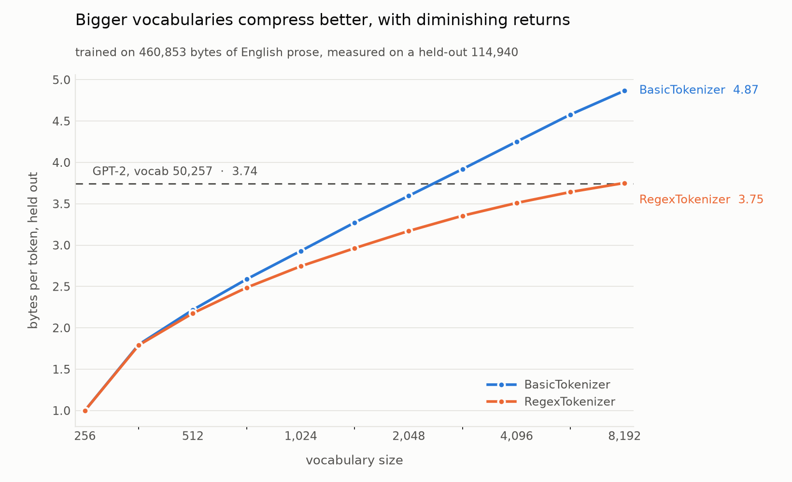

# bpe-tokenizer

A byte-pair-encoding tokenizer written from scratch, whose encoder reproduces
GPT-2's tokenization exactly, token for token, verified against `tiktoken`.

Five of OpenAI's published encodings load and match `tiktoken` token for
token: `gpt2`, `r50k_base`, `p50k_base`, `cl100k_base` (GPT-3.5/GPT-4) and
`o200k_base` (GPT-4o).

```
bpe/
  base.py     get_stats / merge primitives, Tokenizer base class, save + load
  basic.py    BasicTokenizer  - byte-level BPE, no splitting
  regex.py    RegexTokenizer  - GPT-2/GPT-4/o200k split patterns + specials
  gpt2.py     GPT2Tokenizer   - loads OpenAI's encoder.json / vocab.bpe
  ranks.py    RanksTokenizer  - loads .tiktoken files, recovering the merges
  download.py caching, hash-verified downloads of the vocab files
tests/        294 tests, including exact-match tests against tiktoken
benchmarks/   compression_ratio.py - bytes per token vs vocab size, held out
```

## How it works, on one string

Train on `"low low lower lowest"` and ask for a vocabulary of 260, which is
the 256 byte values plus four merges:

```python
from bpe import BasicTokenizer

tok = BasicTokenizer()
tok.train("low low lower lowest", vocab_size=260)
```

The text starts as 20 bytes, one token each. Each round counts every adjacent
pair, merges the most frequent one everywhere at once, and gives the result a
new id:

| # | most frequent pair | count | new token | id | sequence after |
|---|---|---|---|---|---|
| — | — | — | — | — | `l o w ␣ l o w ␣ l o w e r ␣ l o w e s t` (20) |
| 0 | `l` + `o` | 4 | `lo` | 256 | `lo w ␣ lo w ␣ lo w e r ␣ lo w e s t` (16) |
| 1 | `lo` + `w` | 4 | `low` | 257 | `low ␣ low ␣ low e r ␣ low e s t` (12) |
| 2 | `␣` + `low` | 3 | `␣low` | 258 | `low ␣low ␣low e r ␣low e s t` (9) |
| 3 | `␣low` + `e` | 2 | `␣lowe` | 259 | `low ␣low ␣lowe r ␣lowe s t` (7) |

Four things this shows, all of which the implementation has to get right:

- **New tokens are built from old ones.** Step 1 merges `lo`, itself a token
  from step 0. Every token is a tree over the 256 byte tokens, which is why
  `vocab[idx] == vocab[p0] + vocab[p1]` holds for every merge.
- **Merges are ordered, and the order is the priority.** `lo` must be applied
  before `low`, or `low` is unreachable. Encoding replays merges by rank, not
  by frequency in the text being encoded, which is what makes encoding agree
  with training. Storing the merges in anything unordered destroys this.
- **The space binds forward.** Step 2 learns `␣low`, not `low␣`. Mid-sentence
  words carry their leading space, so `dog` and `␣dog` are different tokens
  with different ids (in GPT-2, `9703` and `3290`).
- **Ties go to the leftmost pair.** In step 0 both `l`+`o` and `o`+`w` occur 4
  times; `max()` over the counts dict keeps the first one inserted, which is
  the one that appears earliest in the text. Deterministic, but arbitrary.

Training stops here only because we asked for 4 merges. There is nothing
special about the pairs that remain: the next best pair, `low` + `␣low`, occurs
just once, and a larger `vocab_size` would merge it anyway.

Encoding the same string now costs 7 tokens instead of 20 bytes:

```python
tok.encode("low low lower lowest")
# [257, 258, 259, 114, 259, 115, 116]
# low  ␣low ␣lowe r   ␣lowe s   t
```

### What the split pattern changes

`BasicTokenizer` merges across any byte boundary, so on repetitive text it will
happily learn a token spanning a space. `RegexTokenizer` chops the text into
chunks first (words, digit runs, punctuation runs, whitespace) and runs BPE
inside each chunk, so no merge can cross a chunk boundary. The first six
merges on `"the cat. the cat. the cat. the cat."`:

```
BasicTokenizer   th, the, "the ", "the c", "the ca", "the cat"
RegexTokenizer   th, the, " c", " ca", " cat", " the"
```

The basic one spends its whole vocabulary memorizing one phrase. That is the
entire reason real tokenizers split first. On `"low low lower lowest"` the two
agree exactly, because a space precedes every occurrence of `low` anyway.

## Correctness

294 tests, `.venv/bin/python -m pytest`. Two properties are claimed, and they
are claimed precisely.

### 1. Roundtrip: `decode(encode(t)) == t`

| where | tokenizer | cases |
|---|---|---|
| `test_roundtrip.py` | `BasicTokenizer`, `RegexTokenizer` trained on 300,000 characters of prose at vocab 512 | 3,000 strings each |
| `test_roundtrip.py` | same two | the whole 562,202-character corpus as one string |
| `test_tiktoken_parity.py` | `GPT2Tokenizer` | all 5,000 corpus strings |

The 3,000 strings per tokenizer are 750 paragraphs, 750 lines, 750
sentence-ish fragments, and 750 slices cut at arbitrary character offsets. The
last group matters most: it cuts through the middle of words and multi-byte
characters, and a tokenizer that only roundtrips well-formed input is not
roundtripping, it is getting lucky. Samples are drawn from the whole corpus
while training used only the first 300,000 characters, so 47% of the corpus
they are drawn from is text the tokenizer never saw.

The claim is `text -> ids -> text`, in that direction. The reverse,
`ids -> text -> ids`, is not claimed and is not true in general: `decode` uses
`errors="replace"`, so an id sequence that splits a multi-byte character does
not survive a round trip through `str`.

### 2. Parity: our GPT-2 encoder equals `tiktoken.get_encoding("gpt2")`

Every case below is an exact token-sequence comparison, not a length or a
similarity score.

| test | comparison | cases |
|---|---|---|
| `test_encode_parity_over_full_corpus` | `encode_ordinary` | 5,000 |
| `test_decode_parity_over_full_corpus` | `decode` of tiktoken's own ids | 5,000 |
| `test_encode_parity_by_category` | `encode_ordinary`, split 13 ways | 5,000 |
| `test_special_token_parity` | `encode(..., allowed_special="all")` | 100 |
| `test_encode_parity_over_english_corpus` | 200,000 characters of prose, whole | 1 |
| `test_encode_parity_over_english_corpus` | the same text, per paragraph | 200 |
| `test_gpt2.py` | hand-picked strings, ids pinned | 12 |

`tests/corpus.json` holds 5,000 unique strings, 278,165 characters, generated
by `tests/build_corpus.py` across 13 categories:

```
emoji 600   english_prose 600   cjk 500   whitespace 400   code_python 400
markdown 400   degenerate 350   code_javascript 350   code_c 350
mixed_script 350   arabic 300   cyrillic 300   special_tokens 100
```

`degenerate` is the interesting one: the empty string, and several hundred
single characters including every ASCII codepoint from NUL to DEL. Control
characters, unpaired ZWJ, orphaned skin-tone modifiers and truncated grapheme
clusters are all deliberately included — they are valid UTF-8, and a tokenizer
has no business caring. Lone surrogates are the one deliberate exclusion: they
survive `json.dumps` but not `.encode("utf-8")`, so they would fail for
reasons that have nothing to do with BPE.

`whitespace` covers the cases where GPT-2's `\s+(?!\S)` rule bites, such as a
run of *n* spaces before a word splitting as *n*−1 spaces plus `␣word`.

What is **not** claimed: only the GPT-2 encoding is verified against an
external reference. `BasicTokenizer` and `RegexTokenizer` train their own
vocabularies and are checked against the roundtrip property and internal
invariants, not against any third-party implementation. `GPT4_SPLIT_PATTERN`
ships and its splitting behaviour is tested, but no GPT-4 vocabulary is loaded
and nothing here is compared against `cl100k_base`.

Tests that need the network (OpenAI's vocab files, tiktoken's data, the
Gutenberg corpus) skip cleanly when it is unavailable rather than failing.

## Compression

How much does a bigger vocabulary actually buy you?
`benchmarks/compression_ratio.py` trains on the first 80% of the Sherlock
Holmes corpus (460,853 bytes) and measures bytes per token on the last 20%
(114,940 bytes), which the tokenizer never saw.



```bash
.venv/bin/python benchmarks/compression_ratio.py           # ~18 min, writes .png + .json
.venv/bin/python benchmarks/compression_ratio.py --quick   # ~3 min, powers of two to 2,048
.venv/bin/python benchmarks/compression_ratio.py --replot  # redraw from the saved json
```

Nearly all of that time is `BasicTokenizer`, which has no split pattern and so
encodes by repeatedly scanning one long token list; `RegexTokenizer` encodes
the same held-out text in 0.08s at every vocab size.

| vocab | Basic held-out | Basic train | Regex held-out | Regex train |
|---|---|---|---|---|
| 256 | 1.00 | 1.00 | 1.00 | 1.00 |
| 512 | 2.22 | 2.22 | 2.18 | 2.15 |
| 1,024 | 2.93 | 2.91 | 2.75 | 2.70 |
| 2,048 | 3.60 | 3.60 | 3.17 | 3.17 |
| 4,096 | 4.25 | 4.40 | 3.51 | 3.59 |
| 8,192 | 4.87 | 5.36 | 3.75 | 3.94 |

Vocab 256 is the no-merge baseline: one token per byte, 1.00, exactly.

**Returns diminish, roughly logarithmically.** Each doubling of
`RegexTokenizer`'s vocabulary adds less than the last: +1.18 bytes/token for
256→512, then +0.57, +0.43, +0.34, +0.24. Thirty-two times the vocabulary
between 256 and 8192 buys 3.75× the compression.

**A small in-domain vocabulary catches a big general one.** `RegexTokenizer`
at 8,192 reaches 3.75 bytes/token on this text; GPT-2, with 50,257 tokens,
gets 3.74 on the same bytes. That is not a defeat for GPT-2 — it is the
expected result of comparing a vocabulary trained on Victorian English prose
against one that also has to cover code, CJK, emoji and every other thing on
the internet, measured only on Victorian English prose. Point either tokenizer
at a Python file and the ordering reverses.

**`BasicTokenizer` looks better here and is not.** It reaches 4.87
bytes/token because nothing stops it merging across spaces and punctuation, so
it spends its vocabulary memorizing whole phrases from the training text. Two
symptoms show up in the numbers. Its returns barely diminish (+0.71, +0.67,
+0.66, +0.62 per doubling — it keeps finding phrases), and its train/held-out
gap opens up: at vocab 8,192 it compresses training text 9.1% better than
held-out text, against 4.8% for `RegexTokenizer`. Below vocab 2,048 neither
has a measurable gap; overfitting only starts once the vocabulary is big
enough to memorize. Bytes per token is the metric being plotted here, but it
is not the metric you want to maximize.

Two caveats on the setup. The split is contiguous, so the held-out text is
genuinely unseen prose, but it is the same author and register as the training
half — these are in-domain generalization numbers, and out-of-domain numbers
would be worse. And the sweep trains once at 8,192 and reads every smaller
vocabulary off a prefix of that merge list, which is exact only because merges
are ordered and training is greedy;
`test_compression_benchmark.py` pins that equivalence against training each
size directly.

## Usage

```python
from bpe import BasicTokenizer, RegexTokenizer, GPT2Tokenizer
```

### Train your own

```python
tok = RegexTokenizer()                       # GPT-2's split pattern by default
tok.train(open("corpus.txt").read(), vocab_size=1024)

tok.encode("hello world")                    # -> [list of ids]
tok.decode(tok.encode("hello world"))        # -> "hello world"

tok.save("models/mine")                      # writes mine.model + mine.vocab
loaded = RegexTokenizer()
loaded.load("models/mine.model")
```

`mine.vocab` is for reading, not loading. Each learned token appears with the
two children it came from — step 3 of the worked example above would be written:

```
[ low][e] -> [ lowe] 259
```

### Special tokens

Special tokens are split out of the text *before* BPE runs, so their bytes are
never eligible for merging:

```python
tok.register_special_tokens({"<|endoftext|>": 1024})

tok.encode("hi<|endoftext|>", allowed_special="all")   # -> [..., 1024]
tok.encode("hi<|endoftext|>", allowed_special="none")  # BPEs the literal text
tok.encode("hi<|endoftext|>")                          # raises: default is none_raise
```

The default is `none_raise` so that a special token arriving inside untrusted
user text is an error you see, rather than a silent injection. Naming some
tokens refuses the rest, which is tiktoken's rule and the one that matters:
allowing `<|endoftext|>` is not consent to silently BPE `<|pad|>` as text.

```python
tok.encode(text, allowed_special={"<|endoftext|>"})                          # raises on <|pad|>
tok.encode(text, allowed_special={"<|endoftext|>"}, disallowed_special="none")  # doesn't
```

### GPT-2 and the .tiktoken encodings

```python
gpt2 = GPT2Tokenizer.from_pretrained()   # downloads to data/gpt2/ once, then cached

gpt2.encode_ordinary("hello world")      # [31373, 995]
gpt2.encode("hi<|endoftext|>", allowed_special="all")   # [5303, 50256]
gpt2.decode([31373, 995])                # 'hello world'
len(gpt2.vocab)                          # 50257
```

```python
from bpe import RanksTokenizer

gpt4 = RanksTokenizer.from_pretrained("cl100k_base")   # or o200k_base, r50k_base, p50k_base
gpt4.encode_ordinary("hello world")                    # [15339, 1917]
len(gpt4.vocab)                                        # 100261
```

`from_pretrained(download=False)` fails instead of hitting the network.
`train()` and `load()` raise on both classes: their merges come from OpenAI's
files, and the point of them is to reproduce those exactly.

The two classes exist because the file formats differ, and the difference is
the interesting part. `vocab.bpe` lists the merges outright, in order.
A `.tiktoken` file lists only token bytes and ranks — tiktoken never needs the
merges, because it merges by looking a pair's concatenation up in the rank
table. This package encodes by replaying an ordered merge list, so
`recover_merges()` reconstructs one: the rank *is* the merge order, so
replaying every merge below a token's own rank over its bytes leaves exactly
the two pieces that formed it.

That reconstruction is checked against ground truth rather than against
itself. `r50k_base` is GPT-2's vocabulary in the newer format, so the merges
recovered from it must equal the ones `vocab.bpe` states outright — same
pairs, same ids, same order — and `test_recovered_r50k_merges_match_gpt2`
asserts exactly that.

## Setup

```bash
python3 -m venv .venv
.venv/bin/pip install -r requirements.txt
.venv/bin/python -m pytest
```

The suite takes just over a minute, most of it in the two training runs in
`test_roundtrip.py`.

## Notes

- **Merges are ordered**; position in `Tokenizer.merges` is the priority.
  Encoding applies the lowest-ranked eligible pair, which is what makes
  encoding agree with training.
- **GPT-2's single-byte tokens are not ids 0..255.** `encoder.json` assigns
  them in `bytes_to_unicode` order, so byte `0x21` (`!`) is id 0.
  `GPT2Tokenizer` overrides `_byte_ids` to seed encoding with that
  permutation; tokenizers trained here use the identity mapping.
- **`bytes_to_unicode` is a reversible byte-to-printable-character map**, so
  GPT-2's vocab files can stay plain text with no token containing whitespace
  or a control character. `unicode_to_bytes` inverts it.
- **The `regex` package, not stdlib `re`.** The split patterns need `\p{L}`,
  `\p{N}`, and possessive quantifiers.
- **No module here is named after a stdlib module.** Running a script puts its
  own directory first on `sys.path`, so such a file shadows the real module for
  everything imported afterwards. This is why the benchmark is
  `compression_ratio.py` and not `compression.py`: `compression` became a
  stdlib package in Python 3.14 and `bz2` imports from it, so the shorter name
  broke `bz2` → `shutil` → `matplotlib`.
  `test_no_module_shadows_a_stdlib_module` keeps the whole repo clear of it.
